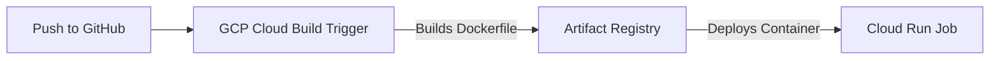

# 🚀 Deploying to Google Cloud Run via Google Cloud Build

This guide outlines the step-by-step setup to automatically build and deploy your containerized Dagster ETL pipeline to Google Cloud Run using **Google Cloud Build Triggers** whenever you push to the `main` branch.

---

## 🏗️ Pipeline Overview



When you push a commit to your GitHub repository, **Cloud Build** is triggered. It builds the Docker container, pushes the resulting image to **Artifact Registry**, and updates the serverless **Cloud Run Job** with the latest build.

---

## 🛠️ Step 1: GCP CLI Setup & Prerequisites

Make sure you are logged in to the Google Cloud CLI and targeting the correct project:

```bash
# Set your active GCP project
gcloud config set project resale-property-sg
```

### 1. Enable Required GCP APIs
Enable the APIs for Artifact Registry, Cloud Run, and Cloud Build:
```bash
gcloud services enable artifactregistry.googleapis.com \
                       run.googleapis.com \
                       cloudbuild.googleapis.com
```

### 2. Create the Artifact Registry Repository
Create a Docker repository in the `asia-southeast1` (Singapore) region:
```bash
gcloud artifacts repositories create resale-repo \
    --repository-format=docker \
    --location=asia-southeast1 \
    --description="Docker repository for HDB Resale ETL"
```

---

## 🔑 Step 2: Configure IAM Permissions

Cloud Build needs permission to deploy the Cloud Run Job and to act as your pipeline's runtime service account. 

Run the following commands in your terminal (using your project number `688608823915`):

```bash
# 1. Allow Cloud Build to deploy and update Cloud Run Jobs
gcloud projects add-iam-policy-binding resale-property-sg \
    --member="serviceAccount:688608823915@cloudbuild.gserviceaccount.com" \
    --role="roles/run.developer"

# 2. Allow Cloud Build to act as your runtime service account
gcloud iam service-accounts add-iam-policy-binding serviceaccount-001@resale-property-sg.iam.gserviceaccount.com \
    --member="serviceAccount:688608823915@cloudbuild.gserviceaccount.com" \
    --role="roles/iam.serviceAccountUser"
```

---

## ⚙️ Step 3: Connect GitHub & Create the Trigger

1. Open the [GCP Cloud Build Triggers Console](https://console.cloud.google.com/cloud-build/triggers?project=resale-property-sg).
2. Click **Manage repositories** at the top, then **Connect repository**.
3. Select **GitHub (Cloud Build GitHub App)**, authenticate with GitHub, and select your repository: `resale-property-sg`.
4. Click **Create Trigger** and use the following configurations:
   * **Name**: `resale-etl-trigger`
   - **Event**: `Push to a branch`
   - **Source Repository**: Select `resale-property-sg`
   - **Branch**: `^main$` *(or your main branch)*
   - **Configuration**: Select **Cloud Build configuration file (yaml or json)**
   - **Cloud Build file location**: `/cloudbuild.yaml`
5. Click **Create**.

---

## 🚀 Step 4: Commit, Push, and Verify

Your repository already has the correct build steps configured in [`cloudbuild.yaml`](file:///Users/zacang/Documents/datascience/resale-property-sg/cloudbuild.yaml). Push your changes to trigger your first automated deploy:

```bash
# Add files to git
git add cloudbuild.yaml DEPLOYMENT.md
git commit -m "chore: configure automated deployment via Cloud Build"

# Push to your main branch to trigger the build
git push origin main
```

To monitor the build progress:
1. Open the [GCP Cloud Build History Dashboard](https://console.cloud.google.com/cloud-build/builds?project=resale-property-sg).
2. Once the build finishes successfully, your Cloud Run Job will be updated. You can view it under [Cloud Run Jobs](https://console.cloud.google.com/run/jobs?project=resale-property-sg).
