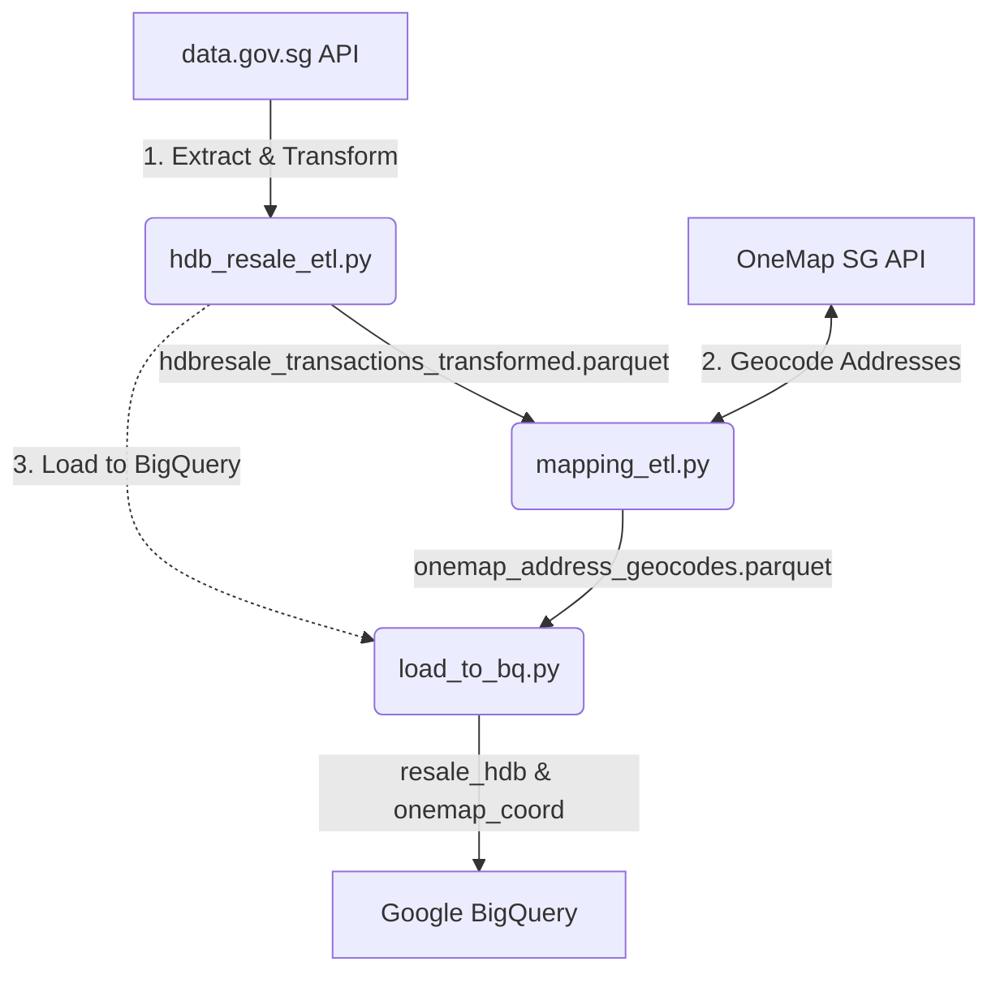

# Singapore HDB Resale Property ETL Pipeline

A modern, serverless ETL and orchestration pipeline for Singapore HDB resale transaction data. This project extracts public transaction data, transforms it for analysis, geocodes block/street addresses using the OneMap API, and loads the output into Google BigQuery.

---

## 🏗️ Pipeline Architecture

The ETL workflow runs in three consecutive stages:



1. **Extract & Transform** ([`hdb_resale_etl.py`](file:///Users/zacang/Documents/datascience/resale-property-sg/etl-scripts/hdb_resale_etl.py)): Downloads records from the open data.gov.sg API, cleans and standardizes schema, parses transaction dates and remaining lease periods, and derives floor-area metrics.
2. **Geocode Addresses** ([`mapping_etl.py`](file:///Users/zacang/Documents/datascience/resale-property-sg/etl-scripts/mapping_etl.py)): Reusable coordinate lookup via OneMap. It extracts unique addresses from the transformed dataset, queries OneMap coordinates, and merges them with existing cached geocodes.
3. **Load to BigQuery** ([`load_to_bq.py`](file:///Users/zacang/Documents/datascience/resale-property-sg/etl-scripts/load_to_bq.py)): Direct bulk import of Parquet files into target BigQuery tables (`resale_hdb` and `onemap_coord`).

---

## ⚙️ Environment & Setup

The project uses [uv](https://docs.astral.sh/uv/) for Python dependency management.

### 1. Installation
```bash
uv sync
```

### 2. Configuration
Create a `.env` file in the root directory:
```env
# OneMap SG Credentials (Required for geocoding)
ONEMAPSG_EMAIL=your-email@example.com
ONEMAPSG_PW=your-password

# Google Cloud Platform (Optional locally, required for BigQuery/GCS)
GCP_PROJECT=resale-property-sg
BQ_LOCATION=asia-southeast1
GOOGLE_APPLICATION_CREDENTIALS=keys/gcp-service-account.json

# Storage Directory (Defaults to local './data' directory if unset)
# DATA_DIR=gs://your-bucket-name/data
```

---

## 🚀 Execution Path 1: Local Run

You can run the ETL processes locally either by invoking the individual scripts sequentially or through Dagster orchestration.

### Option A: Sequential Scripts
Run the steps in order:
```bash
# Step 1: Extract & Transform HDB resale data
uv run python etl-scripts/hdb_resale_etl.py

# Step 2: Geocode addresses with OneMap
uv run python etl-scripts/mapping_etl.py

# Step 3: Load Parquet outputs to BigQuery
uv run python etl-scripts/load_to_bq.py
```

### Option B: Dagster Orchestration
Dagster manages data assets, dependencies, and caching automatically.
```bash
# Launch the local Dagster UI
uv run dagster dev -m orchestration.definitions
```
Access the dashboard at `http://localhost:3000` to materialize assets (`hdb_raw` ➔ `mapping_raw` ➔ `hdb_bq_load` & `mapping_bq_load`).

---

## ☁️ Execution Path 2: Google Cloud Run

For production, the entire pipeline is packaged in a Docker container and deployed as a serverless Google Cloud Run Job, scheduled to run daily.

### 1. Docker Build & Run (Local Verification)

The project includes a [Dockerfile](file:///Users/zacang/Documents/datascience/resale-property-sg/Dockerfile) in the root directory. To build and test the containerized pipeline locally before deploying:

```bash
# Build the Docker image
docker build -t resale-property-sg .

# Run the container locally with your environment variables
docker run --env-file .env resale-property-sg
```


### 2. Deploying as a Cloud Run Job
Use `gcloud` to build and deploy the container job:
```bash
gcloud run jobs deploy resale-pipeline-job \
    --source . \
    --region asia-southeast1 \
    --service-account serviceaccount-001@resale-property-sg.iam.gserviceaccount.com \
    --set-env-vars="DATA_DIR=gs://resale-property-sg-bucket/data,GCP_PROJECT=resale-property-sg,BQ_LOCATION=asia-southeast1,ONEMAPSG_EMAIL=your-email@example.com,ONEMAPSG_PW=your-password"
```

### 3. Scheduling Daily Triggers
Schedule the job to run daily at 2:00 AM Singapore Time via Cloud Scheduler:
```bash
gcloud scheduler jobs create http resale-pipeline-daily-trigger \
    --schedule="0 2 * * *" \
    --time-zone="Asia/Singapore" \
    --uri="https://asia-southeast1-run.googleapis.com/apis/run.googleapis.com/v1/namespaces/resale-property-sg/jobs/resale-pipeline-job:run" \
    --http-method=POST \
    --oauth-service-account-email="serviceaccount-001@resale-property-sg.iam.gserviceaccount.com" \
    --region=asia-southeast1
```

---

## 🧪 Testing

A complete suite of tests covers data transformations and Dagster orchestration logic:
```bash
# Run all tests
uv run pytest

# Run specific orchestration tests
uv run python -m unittest tests/test_orchestration_definitions.py -v
```
